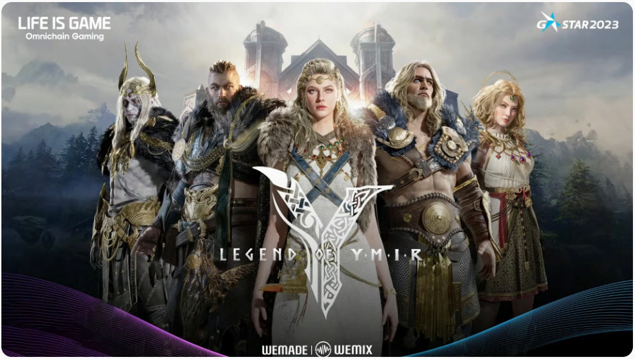
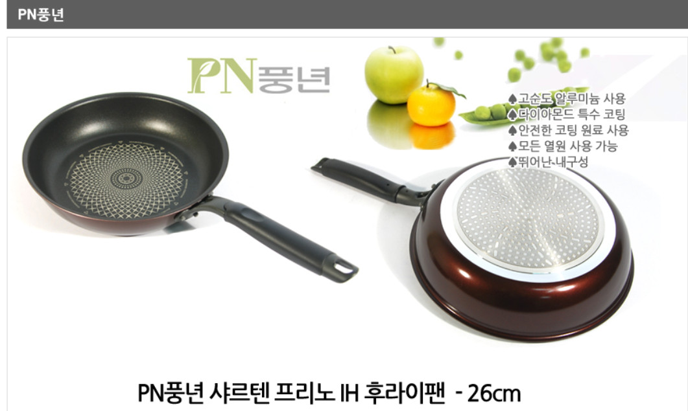
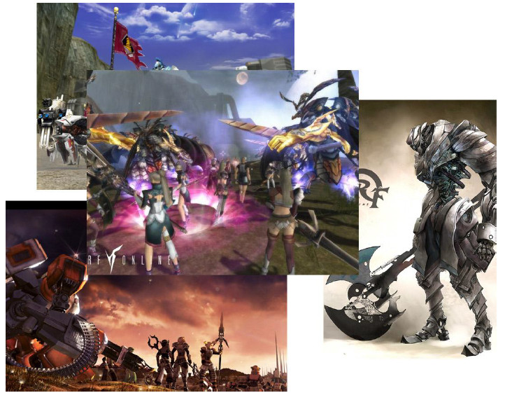
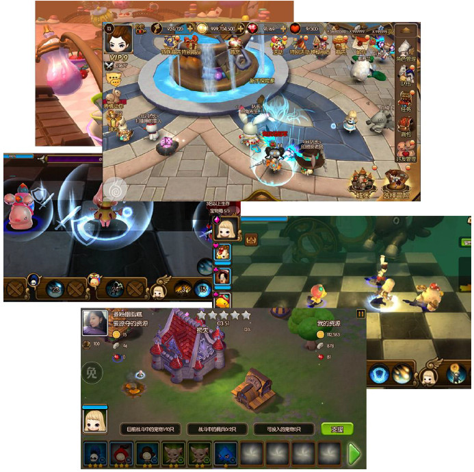
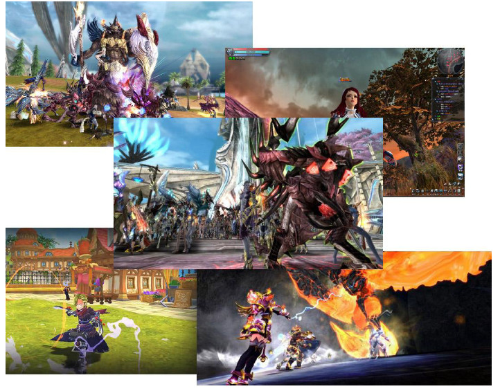
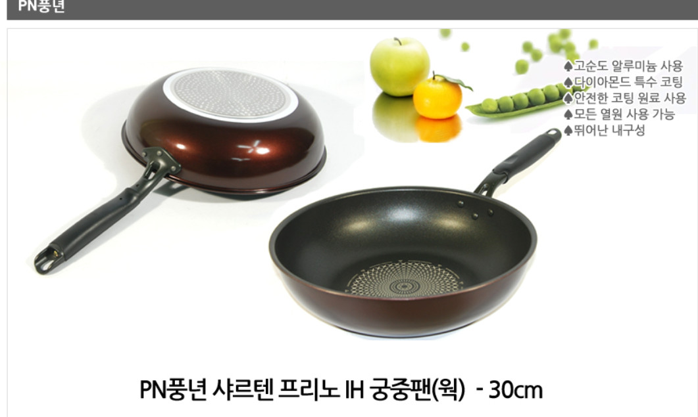

# Career

## 장언일 (Unil Jang)
Game Programmer / Technical Director / Engine Architect  

- 엔진, 서버, 클라이언트, 라이브 서비스까지 게임을 기술적으로 성립시키고 **실제 대규모 서비스(100K+ CCU)**까지 성공시켜 온 테크니컬 디렉터입니다.
- 자체 엔진 제작부터 MMORPG 서버, 모바일 최적화, 글로벌 라이브 운영까지 게임 제작에 필요한 전 기술 영역을 직접 설계하고 구현해왔습니다.

---
## Why Me
- 엔진 → 클라이언트 → 서버 → 라이브 운영까지 전 영역 실무 경험
- 30년 이상 게임 프로그래밍 경력, 패키지·온라인·모바일·Cross-Platform 모두 경험
- 100K+ CCU 규모 MMORPG 실제 서비스 및 안정화 경험
- 저사양 환경에서도 성능과 품질을 동시에 만족시키는 최적화 역량 

---
## Core Strengths

- 게임 개발 전 분야 기술 리딩 (엔진 / 클라이언트 / 서버)
- 자체 게임 엔진 및 상용 엔진 설계 · 제작
- 대규모 MMORPG 서버 안정화 및 라이브 운영
- 고난이도 최적화 (메모리 / 성능 / 용량 / 하드웨어 스케일링)
- PC, Online, Mobile, Cross Platform 게임 제작 경험
- 패키지 게임부터 온라인 · 모바일 게임까지 전 영역 커버 가능

---

## Technical Skills

- **Game Programming**: Engine, Client, Tool, Effect
- **Engine Development**: Rendering, Shader, Resource System, Toolchain
- **Server**: MMORPG Server, TCP/IP, HTTP Server
- **Backend**: PHP, MySQL, Redis, Linux
- **Optimization**: Memory / Performance / Asset / Stability
- **Platform**: PC, Windows, Linux, Android, iOS
- **Cloud**: AWS, Azure 기반 글로벌 서비스 운영 경험

---

## Work Experience

### Wemade XR
**Technical Director (TD)**  
**2017.03 ~ 현재**

#### Legend of Ymir
- 서버 최적화/안정화 담당
- 국내 동시접속자 약 10만 명 규모 서비스
- 글로벌 약 17만 동시접속 규모
- Azure 기반 글로벌 서비스 안정적 런칭 및 운영

#### Icarus M
- 엔진 담당
- PC 버전 성능 최적화
- 모바일 버전 메모리 사용량 최적화
- 전반적인 실행 속도 및 안정성 개선

---

### j2jlab (founder)
**CTO**  
**2013 ~ 2016**

- 자체 엔진 기반 모바일 RPG
- PC 엔진 → 모바일 엔진 전환
- 엔진 / 클라이언트 / 서버 아키텍처 설계 및 구현
- 서버 초기 구축 및 스트레스 테스트 환경 구성

---

### Zerodin Games (founder)
**CTO / CEO**  
**2006 ~ 2012**

- Zerodin Engine 설계 및 제작
- 상용 엔진 라이선스 제공
- 다수 온라인 게임 상용 서비스 지원

---

### CCR (RF Online)
**Development Director / Technical Director**  
**1999 ~ 2006**

- MMORPG **RF Online** 전체 기술 총괄
- R3 Engine 설계 및 제작
- 클로즈 베타 → 오픈 베타 → 상용화
- 해외 50여 개국 수출
- 대한민국 게임대상 온라인 부문 수상 (2004)

---

## Game Projects

### MMORPG / Online

- **Legend of Ymir**  2025
  - 서버 안정화
  - Azure 기반 글로벌 서비스
  - 국내 10만 / 글로벌 17만 동접

  

---
- **Icarus M** 2018
  - 엔진 담당
  - PC / Mobile 성능 및 메모리 최적화

  

---
- **RF Online**  2004
  - 엔진 설계 및 제작
  - Technical Director
  - 최대 동시접속 약 8만

  

---
- **하트캐슬Mobile RPG**  2016
  - 엔진 설계 및 제작, 서버제작.
  - 중국안드로이드(기기 호환율 93.45%), iOS 동시 런칭 
  - Technical Director

  

---

### Engine & Commercial Titles

- Zerodin Engine
  - 드라고나(Dragona)
  - 퀸스블레이드(Queen’s Blade)
  - 불패 온라인
  - 루나달빛도적단(Luna: Moonlight Thieves)
  - 기타 다수 상용 게임

  

---
### Package / Classic Games  1994년~

- 붉은매 (3D RPG)
- 귀천도
- Mutant D.N.A
- Twins
- Shepherd (Demo)

  

---

## Engine Development History

- **Zerodin Engine**
  - Cross-Platform Engine
  - Rendering / Shader / Tool / Effect 직접 구현
  - 상용 라이선스 다수

- **R3 Engine**
  - RF Online 전용 엔진
  - 저사양 고퀄리티 구현
  - 대규모 MMORPG 안정적 서비스

- 1996년부터 소프트웨어 렌더러 기반 3D 엔진 개발 시작

---

## Philosophy

> 패키지 게임부터 온라인 게임, 모바일 게임,  
> Cross Platform 게임까지  
> **게임 제작에 필요한 모든 기술을 직접 구현하고 리딩할 수 있다는 점이  
> 가장 큰 강점입니다.**

